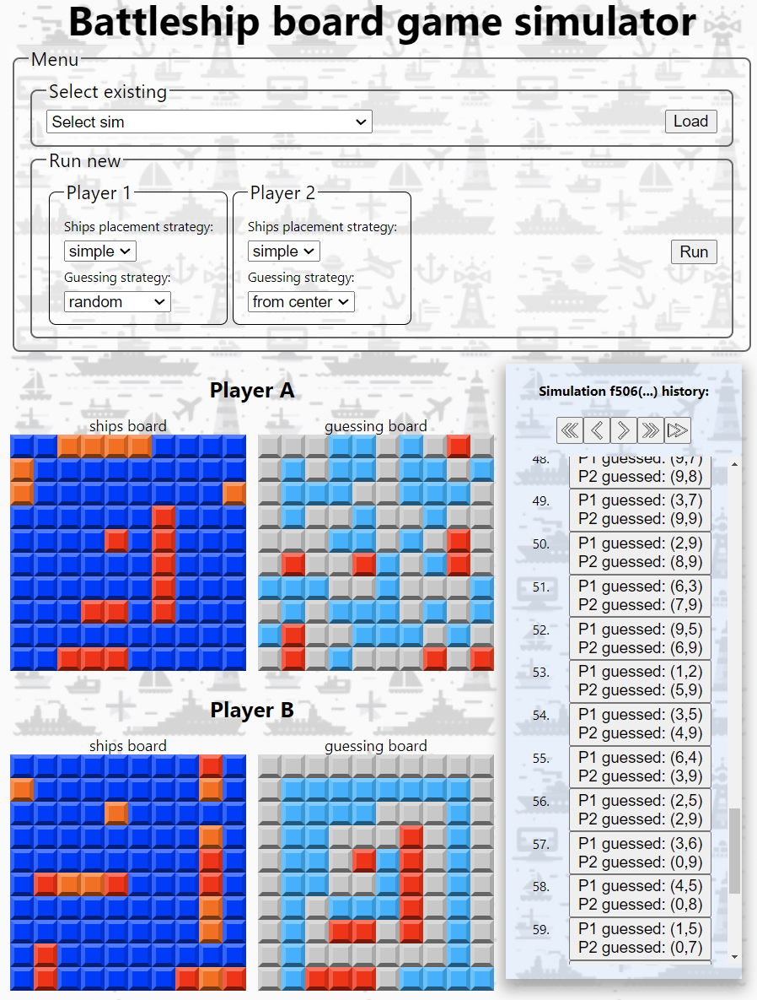

# Battleship Board Game Simulator (Interview Task)

This repository contains the .NET backend and React frontend for an application that allows running Battleship board game simulations and reviewing
them. Most rules are the same as on the [wiki page](https://en.wikipedia.org/wiki/Battleship_(game)). The only difference is an additional rule that
ships cannot touch each other, not even with corners. The rules from the wiki disallow only overlapping of the ships. However, I always play with the
extra rule, and it makes the implementation more interesting.

> The README contains a quick overview of the app. More detailed (and chaotic) information can be found in [notes](Notes.md), which were created
> during development.

### Backend

The backend exposes a simple REST API:

| method | url                          | description                                    |
|--------|------------------------------|------------------------------------------------|
| POST   | /simulations/battleship/new  | starts new simulation and return simulation id |
| GET    | /simulations/battleship/{id} | get information about given simulation         |
| GET    | /simulations/battleship/     | get all simulations' ids                       |

The simulations are stored using Sqlite with EF Core. As this is a demo project, the database is created in user's `Temp` folder.
The database model is rather thin, meaning that result of simulation is stored as minimal information that allows to recreate
simulation course. The justification for it is: as there can be a lot of simulations stored, and simulations are accessed rarely,
it is better to sacrifice some CPU to recreate simulation, rather than keep large data.

To allow extensibility, tasks such as _placing ships on the board_ or _making a guess based on a game state_ are extracted to separate classes.

### Frontend

The frontend is written in React 18 with TypeScript. The app allows running a new simulation as well as loading an existing one. Also, you can review
the simulation by navigating to any round.

